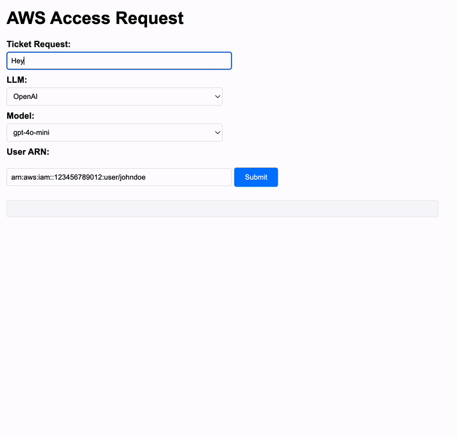

# LLM FastAPI Assistant APP
(Generated from scratch with Grok-3 prompts and refined with Claude 3.5 Sonnet)

This is a simple FastAPI application that generates AWS CLI commands based on user requests using OpenAI or Ollama LLMs.





## Disclaimer

This app is an example of how LLMs can assist with tasks that involve converting user requests into actions or commands.  
All of the code in this repository was generated by Grok-3 and then refined using Claude 3.5 Sonnet in Cursor IDE. Additionally, about 90% of the documentation has been generated by an LLM.

Please note that this app is not intended for production use. Rather, it serves as a starting point for creating your own implementation tailored to a specific use case.

## Table of Contents
- [Disclaimer](#disclaimer)
- [Prerequisites](#prerequisites)
- [Setup and Running the App](#setup-and-running-the-app)
  - [Configure Environment Variables](#configure-environment-variables)
  - [Build and Run the App](#build-and-run-the-app)
- [Web UI](#web-ui)
- [Endpoints](#endpoints)
- [Notes](#notes)
- [How It Works](#how-it-works)
- [Directory Structure](#directory-structure)
- [Testing the App](#testing-the-app)
- [Grok-3 Prompts](#grok-3-prompts)


## Prerequisites

- Docker and Docker Compose installed on your machine.
- An OpenAI API key (if using OpenAI).
- Access to an Ollama instance (if using Ollama).

## Setup and Running the App

1. **Configure Environment Variables**

   Copy the example environment file and edit it:
   ```bash
   cp .env.example .env
   ```
   Then edit the `.env` file to update your configuration, especially the `OPENAI_TOKEN` which is required if using OpenAI.

   For `OLLAMA_BASE_URL`, use the base URL of your Ollama instance (e.g. MacOS: `http://host.docker.internal:11434`, Linux: `http://172.17.0.1:11434`)

2. **Build and Run the App**

   Run the following command in the directory containing `docker-compose.yml`:

   ```bash
   docker-compose up --build
   ```


The app will start and be available at http://localhost:8086.

## Web UI
Visit http://localhost:8086/ in your browser to access the web UI:
- Ticket Request: Enter your AWS access request (e.g., "access S3 for bucket /media").
- LLM: Select "openai" or "ollama".
- Model: Enter the model name (e.g., "gpt-4o-mini").
- User ARN: Enter the IAM user ARN (e.g., "arn:aws:iam::123456789012:user/example").
- Submit: Click the button to get the AWS CLI command and notes displayed below the form.


## Endpoints

### GET /health
Description: Checks if the app is running.

Response: 
```json
{"status": "ok"}
```

POST /tickets
Description: Processes a user request to generate an AWS CLI command.

Request Body:
```json
{
  "llm": "openai",           // or "ollama"
  "model": "gpt-4o-mini",    // model name
  "request": "access S3 for resource for bucket /media"
}
```

Response:
```json
{
  "model": "gpt-4o-mini",
  "llm": "openai",
  "tokens": 150,
  "command": "aws s3api ...",
  "notes": "Ensure the bucket exists."
}
```


## Notes
- The app assumes Ollama has an `/api/generate` endpoint. Adjust the `call_ollama` function if the API differs.
- Token counts are included if provided by the LLM; otherwise, they may be null.
- Ensure environment variables are set correctly to avoid runtime errors.


## How It Works

1. **Endpoints**:
   - `GET /health`: Returns a simple status check.
   - `POST /tickets`: Accepts a JSON payload, processes the request using the specified LLM, and returns an AWS CLI command with additional details.

2. **LLM Integration**:
   - Uses `requests` to call OpenAI or Ollama APIs based on the `llm` field.
   - OpenAI uses the `/chat/completions` endpoint; Ollama assumes an `/api/generate` endpoint (adjust as needed).

3. **Configurable Prompt**:
   - The prompt is set via the `PROMPT_TEMPLATE` environment variable and includes placeholders for `account_id`, `user_iam_id`, `region`, and `request`.

4. **Environment Variables**:
   - `OPENAI_TOKEN`, `OLLAMA_BASE_URL`, and `OPENAI_BASE_URL` configure LLM access.
   - AWS-related variables (`AWS_ACCOUNT_ID`, `AWS_USER_IAM_ID`, `AWS_REGION`) are used in the prompt.

5. **Deployment**:
   - The app runs on port 8086 inside a Docker container built from a Python Alpine image.
   - Docker Compose simplifies running the app with pre-set environment variables.

## Directory Structure

After creating all files, your directory should look like this:

```
.
├── Dockerfile
├── LICENSE
├── Readme.md
├── docker-compose.yaml
├── img
│   └── web.gif
├── main.py
├── requirements.txt
└── templates
    └── index.html
```

### Testing the App

1. Start the app with `docker-compose up --build`.
2. Test the health endpoint:
```bash
   curl http://localhost:8086/health
```

Expected output:
```json
{"status": "ok"}
```

Test the tickets endpoint:

```bash
curl -X POST http://localhost:8086/tickets \
-H "Content-Type: application/json" \
-d '{"llm": "openai", "model": "gpt-4o-mini", "request": "Hi, I need access to S3 for resource for bucket /media. Thanks!", "user_arn": "arn:aws:iam::123456789012:user/example"}'
```

Expected output:

```json
{
    "model": "gpt-4o-mini",
    "llm": "openai",
    "tokens": 265,
    "command": "aws iam attach-user-policy --user-name example --policy-arn arn:aws:iam::aws:policy/AmazonS3FullAccess",
    "notes": "- This command grants the user named \"example\" full access to all S3 resources, including the specified bucket \"/media\".\n- If you want to restrict access to only the \"/media\" bucket, consider creating a custom IAM policy that specifically allows actions on that bucket only, instead of using the managed policy `AmazonS3FullAccess`."
}
```

## Grok-3 Prompts

This is the initial prompt used to generate the code:

```
Let's build a simple python app using FastAPI. 
The app should expose two endpoints:GET /health -> it should return 200
POST /tickets
This endpoint will receive a json payload:

{
    "llm": "ollama/openai",
    "model": "gpt-4o-mini",
    "request": "<user_request>"
}

<user_request> is a text, a ticket created by some user asking for certain AWS access (for example the user asks to access S3 for resource for bucket /media). You should take that text and hit openai or ollama (use python Requests), and the llm should return the aws-cli command that the admin should run to accomplish that.
The endpoint should return a json response like this:

{
    "model": "model used",
    "llm": "llm_used",
    "tokens": "tokens used (if available)",
    "command": "aws command",
    "notes": "extra notes if available"
}

Add a configurable prompt for the llm that takes into account the AWS account_id, user_iam_id, aws_region. Add env var for openai_token, ollama_base_url, openai_base_urlCreate a single python file with everything, a dockerfile that uses python apline image, and a docker-compose file that I can use to run the app. The app should use port 8086. Add a readme.md file with simple instructions on how to run the app.
```
